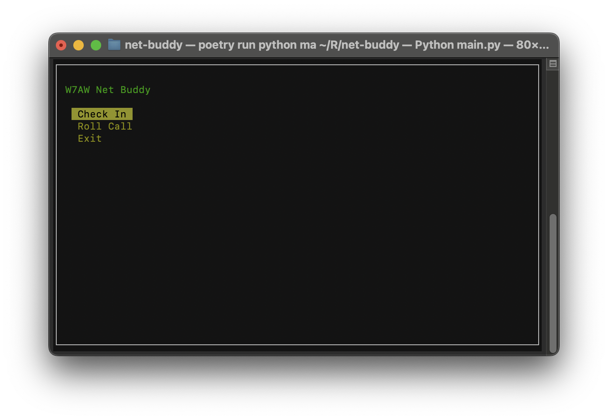

Net Buddy
=========

A tool to help make running the weekly W7AW social nets a bit easier. It
serves as an easier to use interface to the spreadsheet we use to keep track of
check-ins and perform the roll-call at the beginning of the net.



## Usage
Run via
```shell
poetry run python main.py
```

## Setup

You'll need an OAUTH Application that's enabled for Google Sheets.
* Follow https://docs.gspread.org/en/latest/oauth2.html#for-end-users-using-oauth-client-id
  to get your credentials file, which should be named `client_secrets.json` and 
  live at the root level of the repository.
* Update the value of `SPREADSHEET_URL` in `main.py` to the link to your copy
  of the weekly net check-in sheet. You'll want to ensure that the call signs
  are in Column A and that any header rows are trimmed so that the month row
  is the top row.
  * If you are a member of W7AW, you can refer to
    https://docs.google.com/spreadsheets/d/1OopTFBHSx3TWb1ANjdAHr-rpfO-7ImbwpIpwLJ8oLXY/edit?usp=sharing
    to see the version that I use.
